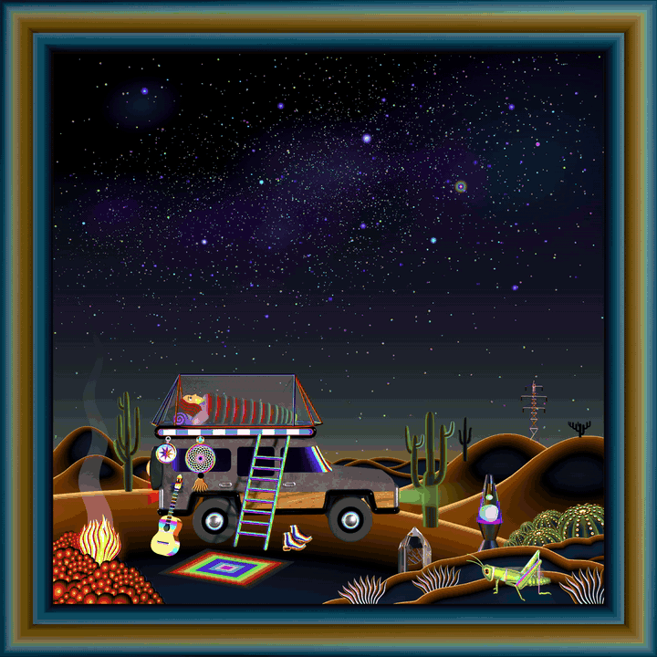
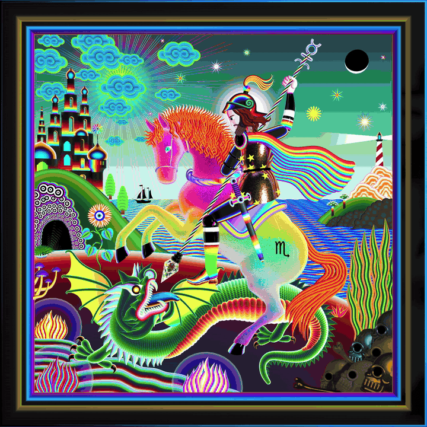
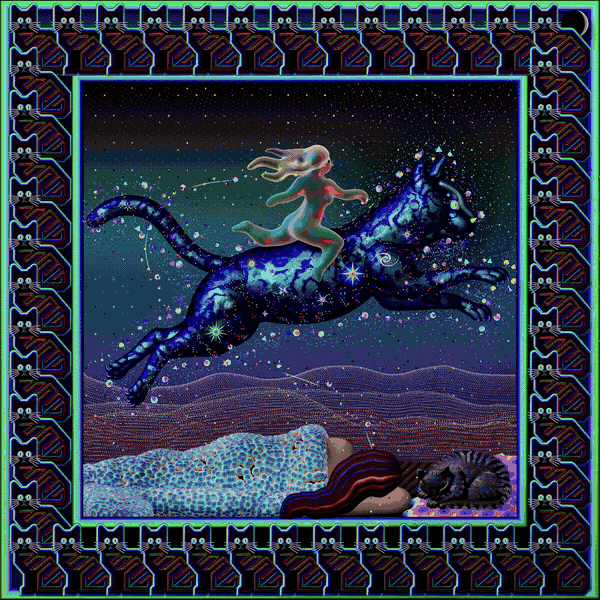

<div align="center">

</div>

<br/>

<div align="center">

### 🔮 [apacheta-app.vercel.app](https://apacheta-app.vercel.app)

[](https://threejs.org)
[](#)
[](https://apacheta-app.vercel.app)
[](https://mongoosejs.com)

</div>

---

## Sistema de Telemetría Personal · Browser-Native · Additive Only

**Apacheta** — del término andino: la acumulación de piedras en equilibrio que los viajeros dejan en los cruces de caminos de montaña. Los cimientos más pesados abajo. Las ideas más ligeras arriba.

Esto no es una app de notas. No es un Notion espiritual. No es un Headspace con skin nueva. Es un **espejo biotecnológico** — un sistema de **telemetría para el cerebro humano** desarrollado en Córdoba, Argentina. La persona se carga a sí misma — colores del día, mandala, notas, likes a frases — y la app le devuelve su propia esencia organizada, visualizada, más profunda.

El sistema rechaza categóricamente los patrones de diseño adictivos: no hay algoritmos de dopamina, no hay feeds sociales, no hay modo oscuro infinito. La interfaz **respira con el usuario**, adaptando su estética al ritmo circadiano. **Additive Only** — el código nunca se elimina, se apila en capas, igual que las piedras de una apacheta real.

> *"El sistema aprende tu lenguaje. Entiende tus aristas. Te devuelve conocimiento en el momento justo, en el formato visual correcto, con el tono exacto."*


## Por qué importa técnicamente

**Para equipos de Vercel / Serverless:**
La arquitectura demuestra que una aplicación de bienestar personal con estado persistente, múltiples módulos 3D, IA contextual y personalización en tiempo real puede desplegarse como **static + serverless functions** sin un backend de estado. MongoDB Atlas + Vercel Serverless = infraestructura que escala desde 1 usuario a 100,000 sin rediseño de arquitectura. Zero DevOps overhead.

**Para empresas de Web3 / Soberanía Digital:**
Apacheta es la implementación técnica del concepto de **soberanía de datos personales**. El usuario es el único propietario de su aura history, sus manifiestos, sus notas. El Oracle procesa todo localmente primero (fallback SECTIONS_SCHEMA) antes de consultar APIs externas. La arquitectura puede migrar a on-chain identity storage sin modificar la capa de UI — los endpoints de API son swappable por contract calls. La frase "la soberanía no se declama, se codea" es literal.

**Para equipos de Producto / Wellness Tech:**
El Aura Composer genera un **emotional state vector** de 5 dimensiones (calma, foco, creatividad, energía, intuición) que persiste con timestamp y alimenta cada módulo de la app en tiempo real. No es personalización estática por "usuario tipo" — es personalización dinámica por **estado del usuario en este momento**. El Oracle recibe este vector y adapta el copy, la selección de frases, la música sugerida y los rituales matutinos. Esto es product-market fit demostrado técnicamente.

**Para equipos de Front-End / Web Performance:**
Spring Physics nativa sin bibliotecas de animación: `velocity += (target - current) * stiffness; velocity *= damping`. Stiffness: 0.12, damping: 0.75. Navigation fluida de app nativa iOS a 60 FPS en el browser. Un único canvas Three.js WebGPU detrás de todo el DOM — Section Isolation via IntersectionObserver bloquea el RAF cuando el módulo 3D sale del viewport. GPU al 0% en secciones no visibles. Arquitectura de performance que justifica la elección Vanilla sobre React.


## Modos Circadianos

La interfaz adapta su ADN visual al reloj biológico del usuario. No es un toggle manual — el sistema calcula el modo por horario y lo aplica globalmente a tipografía, paleta, animaciones y tono del Oracle:

| Modo | Horario | Estética | Tono del Oracle |
|---|---|---|---|
| **NATURE** · Mañana | 06:00 – 12:00 | Crema / Blanco (Antigravity) | Claridad, energía física, concreción suave |
| **ACTION** · Tarde | 12:00 – 20:00 | Verde / Amarillo lima | Creatividad, acción, conexión de ideas |
| **DARK** · Noche | 20:00 – 06:00 | Azul marino profundo | Expansión emocional, introspección, silencio |
| **HALLUCINATION** | Experimental | Rosa, celeste, activos animados | *"¿Y si el universo aprendió a verte?"* |

El modo HALLUCINATION no tiene horario — se activa manualmente y sirve como estado de exploración creativa: los módulos generativos (Mandala, Lissajous, Fibonacci) se comportan diferente, los colores saturan, los pulsos se amplifican.


## Interfaz

Las ventanas de cada sección son **draggables** — el usuario puede reposicionarlas libremente en el canvas, creando su propio layout de trabajo. No hay disposición fija. El sistema recuerda la última posición de cada módulo. Esta decisión no es cosmética: es la diferencia entre una app que impone su flujo y una herramienta que se adapta al flujo de pensamiento del usuario.

La navegación completa usa Spring Physics computada en el game loop — sin CSS transitions, sin GSAP, sin Framer Motion. El resultado es fluidez táctil idéntica a una app nativa iOS corriendo en el browser a 60 FPS.

<table>
<tr>
<td width="40%"></td>
<td width="60%"></td>
</tr>
</table>

<br/>

<table>
<tr>
<td width="33%"></td>
<td width="33%"></td>
<td width="33%"></td>
</tr>
</table>


## Sections

<table>
<tr>
<td align="center" width="25%">
<br/>
<b>🌌 Visualising Wisdom</b>
<br/><br/>
<sub>Una frase filosófica toma la pantalla completa con fondo sideral. El Oracle la elige según tu estado emocional del momento — no es aleatoria, es contextual. El emotional state vector del Aura Composer filtra la base de frases por resonancia semántica. <em>"La sabiduría es saber que soy nada, el amor es saber que soy todo."</em> — Nisargadatta Maharaj</sub>
<br/><br/>
</td>
<td align="center" width="25%">
<br/>
<b>📚 Biblioteca</b>
<br/><br/>
<sub>Galería de referencias culturales, filosóficas y técnicas. Cada obra es un portal draggable — al girarla revelás las "notas del artista" y conexiones profundas. Tags semánticos que alimentan al Oracle para sugerencias cruzadas inesperadas. <em>"Obras que definen tu frecuencia."</em></sub>
<br/><br/>
</td>
<td align="center" width="25%">
<br/>
<b>✨ Aura Composer</b>
<br/><br/>
<sub>Cinco sliders de estado: calma, foco, creatividad, energía, intuición. El resultado se guarda con timestamp — el Oracle usa este vector 5D para personalizar todo el contenido de la sesión. Tu estado emocional convertido en telemetría cromática que alimenta cada módulo.</sub>
<br/><br/>
</td>
<td align="center" width="25%">
<br/>
<b>🔮 Oracle</b>
<br/><br/>
<sub>Recibe tu <code>feedbackBus</code> (aura + historial de 7 días), los keys de la sección activa y el intent. Consulta NotebookLM y devuelve copy en JSON adaptado por sección. Fallback local con <code>SECTIONS_SCHEMA</code> semántico si no hay API key. La personalización no requiere cloud.</sub>
<br/><br/>
</td>
</tr>
<tr>
<td align="center" width="25%">
<br/>
<b>🌀 Mandala</b>
<br/><br/>
<sub>Canvas de dibujo simétrico — tu trazo se multiplica en 4, 6, 8 o 12 ejes. Exportable como PNG. Puede convertirse en el fondo dinámico de tu interfaz personal. <em>"Trazá · repetí · trascendé."</em></sub>
<br/><br/>
</td>
<td align="center" width="25%">
<br/>
<b>〜 Lissajous</b>
<br/><br/>
<sub>Dos frecuencias en danza. Curvas matemáticas interactivas — frecuencia X/Y, fase y amplitud en tiempo real. La visualización de tu frecuencia interna. El punto donde la razón áurea y la música se tocan.</sub>
<br/><br/>
</td>
<td align="center" width="25%">
<br/>
<b>🌅 Morning Journey</b>
<br/><br/>
<sub>Ritual matutino en tres pasos: intención del día, gratitud, primera acción concreta. El Oracle personaliza el texto según tu aura del momento. La gamificación es sutil — el sistema trackea días consecutivos y ajusta la dificultad de las preguntas de reflexión.</sub>
<br/><br/>
</td>
<td align="center" width="25%">
<br/>
<b>👁 Meditación Ojo</b>
<br/><br/>
<sub>Visualización de tercer ojo con timer configurable, guía de respiración (4-7-8, Box Breathing, Coherencia Cardíaca 5.5 rpm). Pulsos animados con shaders TSL. Minimalista por diseño — sin notificaciones, sin interrupciones.</sub>
<br/><br/>
</td>
</tr>
<tr>
<td align="center" width="25%">
<br/>
<b>🎵 LoFi</b>
<br/><br/>
<sub>Reproductor para estados de concentración y flujo profundo. Integrado con Aura Composer — si tu energía está alta, el Oracle sugiere tracks con mayor tempo. La curación musical responde al estado emocional registrado.</sub>
<br/><br/>
</td>
<td align="center" width="25%">
<br/>
<b>🕸 Conexiones</b>
<br/><br/>
<sub>Grafo interactivo renderizado con Three.js WebGPU. Los nodos son ideas, las aristas son relaciones. Draggable, zoomeable, exportable. <em>"Todo lo que existe está conectado. Basta con mirar."</em> Marco Aurelio + neuroplasticidad + un álbum de 1972.</sub>
<br/><br/>
</td>
<td align="center" width="25%">
<br/>
<b>🌀 Fibonacci</b>
<br/><br/>
<sub>La espiral de Fibonacci y φ=1.618 animadas con TSL shaders. Tipografía en jerarquía de Círculos Fibonacci — los elementos más grandes en la base del pulgar, decreciendo hacia arriba. El patrón universal visible.</sub>
<br/><br/>
</td>
<td align="center" width="25%">
<br/>
<b>📝 Manifiestos</b>
<br/><br/>
<sub><em>"Escribí tu propia Biblia. Nadie más puede hacerlo."</em> Manifiestos con versionado completo. El sistema analiza lo que escribís para personalizar el copy de toda la app. Exportable como PDF editorial. Cada versión es un snapshot inmutable del estado de pensamiento del usuario.</sub>
<br/><br/>
</td>
</tr>
</table>


## Decisiones de arquitectura

| Decisión | Por qué |
|---|---|
| **Vanilla JS sin framework** | Sin framework treadmill. El código es un activo estratégico que no requiere reescritura cada 18 meses. Spring Physics en el game loop — sin overhead de reconciliación VDOM a 60Hz. |
| **Singleton Three.js Renderer** | Un único canvas WebGPU global detrás del DOM. Section Isolation via IntersectionObserver — GPU al 0% cuando el módulo sale del viewport. Cero contención entre módulos 3D. |
| **Spring Physics sin librerías** | `velocity += (target - current) * stiffness; velocity *= damping` (stiffness: 0.12, damping: 0.75). Fluidez táctil de app nativa iOS. Sin GSAP, sin Framer Motion, sin dependencias de animación. |
| **Ventanas draggables** | El layout no impone el flujo de pensamiento del usuario. Cada ventana es reposicionable — el sistema recuerda posiciones. Una herramienta que se adapta, no que dirige. |
| **Additive Only** | El código no se elimina, se apila en capas de complejidad. Igual que las piedras de una apacheta real. Versionado completo de cada módulo — rollback sin pérdida de capas superiores. |
| **Oracle con fallback local** | La personalización funciona sin API key. El `SECTIONS_SCHEMA` semántico cubre el 80% de casos de uso. NotebookLM es una mejora, no un requisito. Offline-first por diseño. |
| **Emotional State Vector 5D** | No hay "usuario tipo" estático. El aura vector cambia con cada sesión y recalibra el contenido en tiempo real. Esto es lo que diferencia la personalización de Apacheta de cualquier app de bienestar existente. |

## Ingeniería Soberana

**Vanilla-first** — sin frameworks, sin framework treadmill. HTML5 + CSS3 + Vanilla JS puro. El código es un activo estratégico que no requiere reescritura cada 18 meses.

**Zero Lag** — Singleton Three.js Renderer WebGPU r183. Un único canvas global detrás del DOM. Spring Physics para toda la navegación: `velocity += (target - current) * stiffness; velocity *= damping`. Fluidez táctil de app nativa iOS a 60 FPS estables.

**Section Isolation** — IntersectionObserver orquesta el ciclo de vida de cada módulo 3D. Cuando una sección sale del viewport: requestAnimationFrame bloqueado, GPU al 0%. Escalable a infinitas secciones sin comprometer el hilo principal.

**Additive Only** — el código no se elimina, se apila en capas de complejidad. Igual que las piedras de una apacheta real.

## Stack

```
Three.js r183 WebGPU  →  Singleton renderer, canvas detrás del HTML
Vite 5.0              →  Dev server + bundler (puerto 3005)
Vercel                →  Serverless API + deploy edge
MongoDB/Mongoose      →  Notas, aura history, manifiestos, versiones
NotebookLM            →  Oracle AI — copy adaptativo (con fallback local)
Spring Physics        →  stiffness: 0.12, damping: 0.75 — navegación táctil
```

## API

```
POST /api/oracle          → Copy dinámico por sección (NotebookLM / fallback SECTIONS_SCHEMA)
GET  /api/aura            → Estado emocional actual del usuario
POST /api/aura            → Guardar estado emocional con timestamp
GET  /api/notes           → Lista de notas con tags semánticos
POST /api/notes           → Nueva nota
GET  /api/notes/[id]      → Nota específica
PUT  /api/notes/[id]      → Actualizar nota
GET  /api/manifiestos     → Lista de manifiestos con versiones
POST /api/manifiestos     → Nuevo manifiesto
GET  /api/manifiestos/[id]→ Manifiesto específico
GET  /api/user            → Perfil de usuario
POST /api/app-schema      → Schema completo para contexto del Oracle
```

## Demo

<table>
<tr>
<td width="50%"></td>
<td width="50%"></td>
</tr>
</table>



## Dev

```bash
npm install
npm run dev    # → http://localhost:3005
npm run build  # → dist/
```

```
NOTEBOOKLM_NOTEBOOK_ID=tu_notebook_id
MONGODB_URI=tu_connection_string
```

<br/>


